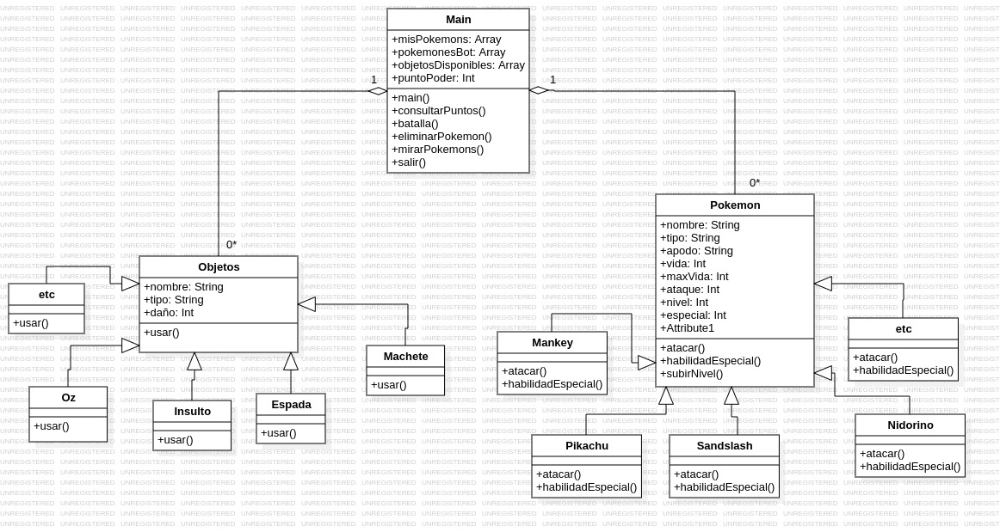

# Pokémon Game

¡Bienvenido al proyecto **Pokémon Game**! Este es un juego interactivo basado en la consola donde puedes crear, subir de nivel y luchar con tus Pokémon favoritos.

---

## 📋 Tabla de Contenidos

- [Descripción](#descripción)
- [Características](#características)
- [Requisitos](#requisitos)
- [Instalación](#instalación)
- [Uso](#uso)
- [Estructura del Proyecto](#estructura-del-proyecto)
- [Tecnologías Utilizadas](#tecnologías-utilizadas)
- [Autores](#contribuciones)

---

## 📝 Descripción

Este proyecto es un juego de Pokémon basado en javaScript y Node que se ejecuta en la consola. Los jugadores pueden:
- Mirar sus Pokémon.
- Crear nuevos Pokémon.
- Subir de nivel a sus Pokémon.
- Eliminar Pokémon.
- Ver los puntos de poder acumulados.
- Ejecutar Batallas Pokémon.

El juego utiliza la biblioteca `inquirer` para la interacción con el usuario y `chalk` para mejorar la experiencia visual en la consola.

---

## ✨ Características

- **Entrenamiento de Pokémon**: Sube de nivel a tus Pokémon y mejora sus habilidades.
- **Batallas**: Lucha contra Pokémon controlados por la computadora.
- **Objetos**: Usa objetos para potenciar a tus Pokémon.
- **Interfaz de consola interactiva**: Fácil de usar y visualmente atractiva.

---

## ✅ Requisitos

Antes de comenzar, asegúrate de tener lo siguiente instalado en tu sistema:

- [Node.js](https://nodejs.org/) (versión 14 o superior)
- [npm](https://www.npmjs.com/) (gestor de paquetes de Node.js)

---

## 🚀 Instalación

Sigue estos pasos para instalar y ejecutar el proyecto en tu máquina local:

1. Clona este repositorio:
   ```bash
   git clone https://github.com/Carlosvillamizar09/pokemon-main

2. Navega al directorio del proyecto:
   ```bash
   cd pokemon-main

3. Instala las dependencias:
   ```bash
    npm install inquirer chalk

4. Ejecuta el juego:
   ```bash
   node index.js

## 🎮 Uso

Sigue las instrucciones en la consola para interactuar con el juego. Puedes elegir entre varias opciones del menú para gestionar tus Pokémon y participar en batallas.

## 🗂️ Estructura del Proyecto

- `index.js`: Punto de entrada del juego.
- `funciones/`: Carpeta que contiene todas las funciones del juego.
    - `inicializacion_objetos.js`: Inicialización de objetos y variables globales.
    - `mostrarBarraVida.js`: Función para mostrar la barra de vida de los Pokémon.
    - `batalla.js`: Funciones relacionadas con las batallas Pokémon.
    - `subir_nivel.js`: Funciones para entrenar y subir de nivel a los Pokémon.
    - `main.js`: Función para mostrar el menú principal y manejar la navegación.
    - `consultar_puntos.js`: Funcion para consultar puntos de poder.
    - `crear_pokemon.js`: Función para crear nuevos Pokémon.
    - `eliminar_pokemon.js`: Función para eliminar Pokémon.
    - `mirar_pokemon.js`: Función para ver los Pokémon disponibles.
- `clases/`: Carpeta que contiene todas las clases del juego.
- `package.json`: Archivo de configuración del proyecto y gestión de dependencias.
- `README.md`: Documentación del proyecto.
- `.gitignore`: Archivo para ignorar archivos y carpetas en Git.


## Diagrama UML



## 🛠️ Tecnologías Utilizadas

- [Node.js](https://nodejs.org/)
- [Inquirer](https://www.npmjs.com/package/inquirer)
- [Chalk](https://www.npmjs.com/package/chalk)

## Video Sustentación

[Video Presentación](https://youtu.be/EPAZLhUjHcI)

## 🤝 Autores

- Carlos Villamizar - [GitHub](https://github.com/Carlosvillamizar09)
- Davisson Adriel - [GitHub](https://github.com/Davisson-Adriel)
- Fabian Peruz - [GitHub](https://github.com/FabianPertuz)